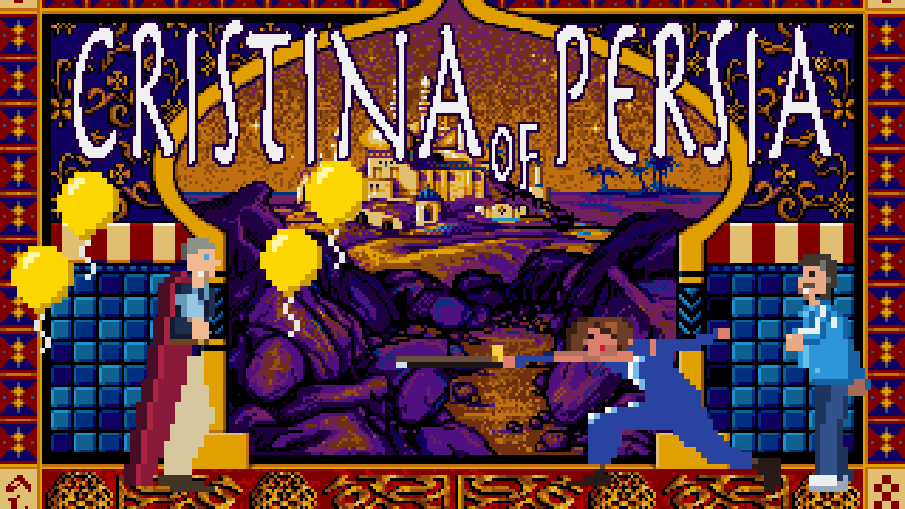

# Cristina of Persia

Parodia argentina de *Prince of Persia* (Jordan Mechner, 1989) para SDLPoP.

| Original | En el mod |
|---|---|
| El príncipe | Cristina: melena castaña con flequillo, labios rojos, traje azul y la banda presidencial celeste y blanca con el sol de mayo |
| Tomar una poción | Cristina toma de la petaca y se convierte un rato en Bullrich borracha (y se tambalea) |
| La espada (en la mano y en el piso) | El bastón presidencial (puño dorado, borla, contera) |
| La princesa | Máximo: pelo enrulado, barba, camiseta de Racing de manga corta, jean y zapatillas |
| Jafar, el visir | Mauricio: canoso, afeitado y sonriente, traje azul, camisa celeste y corbata amarilla; al entrar en escena suben globos amarillos |
| Los guardias (y el guardia gordo) | Bufones, como el comodín: gorro de dos puntas con cascabeles, gorguera, jubón rojo con rombos de arlequín (el color de los rombos cambia según lo fuertes que son), calzas amarillas y zapatos enroscados |
| La espada de los guardias | Una trompeta dorada (Mauricio y el esqueleto siguen con espada) |
| Pociones chica / grande | Petaca / botella de whisky (calabozo) o de vodka (palacio) |
| Pinches | Palas, muchas palas, con un cartel del FMI |
| Título e historia | "Cristina of Persia", textos en castellano, "a game by Axel Laban & Jordan Mechner" |

## Jugar

En `SDLPoP.ini`:

```
levelset = CristinaOfPersia
```

y abrir `prince` (o `Jugar_Prince_of_Persia.command` en Mac).

Algunas cosas necesitan el `prince` compilado con los cambios de este repo
(con un SDLPoP sin cambios el mod igual funciona, pero sin estos extras):

- bastón sólo para Cristina, trompeta para los bufones, espada para Mauricio y el esqueleto
  (`add_sword_to_objtable`, src/seg006.c)
- Bullrich al tomar una poción (`id_chtab_10_kid_alt`, `kid_alt_time`)
- globos amarillos en la intro (`draw_balloons`, src/seg001.c)
- cartel del FMI en los pinches (`SPIKE_SIGN_IMAGE`, src/seg008.c)

La música de la entrada de Mauricio es una marcha original (`tools/make_jingle.py`); se puede
reemplazar, ver `music/LEEME.txt`.

Los textos del juego (menú de pausa, "NIVEL 1", "QUEDAN 5 MINUTOS", etc.) están traducidos en el
código (`src/`). Van sin tildes ni ñ porque las fuentes del juego no las tienen. Las opciones
técnicas dentro de "OPCIONES" siguen en inglés.

## Regenerar los gráficos

Todo se genera por script a partir de los originales de `data/` (Python 3 + Pillow):

```
python3 tools/make_all.py
```

| Script | Qué genera |
|---|---|
| `make_kid.py` | Cristina (`KID/res401-619`) |
| `make_bullrich.py` | Bullrich borracha (`KID/res1401-1619` + `res1400.pal`) |
| `make_flask.py` | La petaca en la mano al tomar (`KID/res593-607`, `res1593-1607`) |
| `make_baton.py` | Bastón (`PRINCE/res735-768` + `res700.pal`) |
| `make_items.py` | Bastón en el piso, petaca, whisky, vodka y cartel del FMI (`PRINCE/res160-165,174` + `res150.pal`) |
| `make_maximo.py` | Máximo y el abrazo final (`PV/res801-817`, `res901-930`) |
| `make_macri.py` | Mauricio villano en escenas y nivel 13, y el globo (`PV/res851-888,963`, `VIZIER/res751-784`) |
| `make_bufones.py` | Bufones: paletas (`PRINCE/res10.bin`) y sprites (`GUARD/res751-784`, `FAT/res751-784`) |
| `make_trumpet.py` | Trompeta de los bufones (`PRINCE/res769-802` + `res700.pal`) |
| `make_title.py` | Logo, créditos e historia (`TITLE/res42-44,52-54`; usa fuentes de macOS) |
| `make_promo.py` | La imagen promocional (`promo.png`), con los sprites del juego |
| `make_icon.py` | Favicon e íconos de la app web (`webbuild/favicon*`, `icon-*.png`, `apple-touch-icon.png`) |
| `make_jingle.py` | Marcha de la entrada de Mauricio (`music/story_3_Jaffar_enters.ogg`; necesita `numpy` y `soundfile`) |
| `make_shovels.py` | Palas en lugar de pinches (`VDUNGEON` y `VPALACE/res328-343`) |



Los créditos del juego original (Jordan Mechner y equipo) se mantienen.
